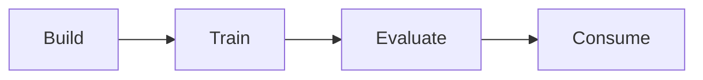

1. Related [Github issue](https://github.com/red-gate/sqlmonitor/issues/23060).

2. [Tutorial link](https://github.com/dotnet/machinelearning-samples/blob/main/samples/csharp/getting-started/AnomalyDetection_PowerMeterReadings/README.md)

# How to solve the problem?

